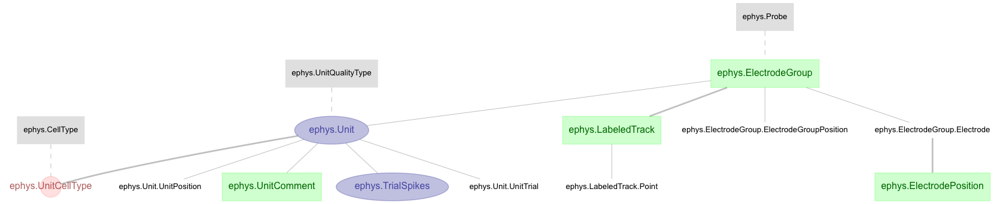

# map-ephys

Mesoscale Activity Project Pipeline - [Map-Ephys](https://github.com/mesoscale-activity-map/map-ephys/)

## Overview

The MAP data pipeline is built using [DataJoint](http://datajoint.io), an
open-source framework for building scientific data pipelines. Users and data
scientists collaborate to define the structure of the pipeline with multiple
stages of data entry, acquisition, processing, and analysis.  They query data
using DataJoint\'s query language.  Experimental data streams are connected
upstream; analyses are made available to downstream applications as soon as new
data are available. DataJoint provides built-in support for parallel and
distributed batch computations. The pipeline is hosted in the [Amazon
Cloud](https://aws.amazon.com) and administered by [Vathes
LLC](https://www.vathes.com/).

The first part of the pipeline deals with entering manual data, and ingesting
and preprocessing the raw acquired data.  Static information like subject
details or experiment parameters are entered manually using
[Helium](https://mattbdean.github.io/Helium/) , a DataJoint-aware web data entry
interface.  These basic data serve as the start of the data pipeline.  From
here, behavioral data are detected as they are written to network shares by the
experimental computers and ingested into the DataJoint pipeline.  Manual spike
sorting is performed offline and separately and then detected and loaded into
the pipeline.  Bulky raw data (behavioral videos; raw ephys files) are
transferred via a separate segment of the pipeline over
[Globus/GridFTP](https://www.globus.org/) to archival storage hosted at ANL and
then removed from the source systems to free storage up space.  The archival
data transfer is managed by DataJoint as part of the pipeline itself; as a
consequence, the raw data can be easily retrieved or more widely published to
other remote users as DataJoint queries.  Additional data navigation and
retrieval interfaces are planned to facilitate more casual internal and public
access to the raw project data and provide support for publication-ready
identifiers such as [DOI](https://www.doi.org/).
 
The second part of the pipeline executes user-maintained analysis of the
acquired data.  The pipeline maintains dependencies between the data at each
stage of acquisition and processing.  As soon as any step of analysis completes
a portion of the data, it becomes available for the next step in analysis in a
distributed fashion.  Thus complex analyses are performed in discrete,
reproducible stages using Matlab or Python query interfaces. In collaborative
scenarios, private \'test\' pipeline segments are first developed and debugged and
then grafted into the main pipeline codebase via code merge/review and then made
available for more permanent or official public use within the team.
 
Cloud hosting of the project pipeline enables sharing of analysis results in
real-time to other collaborators within the project community and, in future
stages of the project, will also allow more public access to the data, both
using DataJoint and also via more casual interfaces under development. Cloud
hosting also allows centralizing the project data into a single data repository
which facilitates easier long-term data stewardship and maintenance.
 
When possible, DataJoint schemas are consistent and compatible with the
[Neurodata Without Borders (NWB)](https://www.nwb.org/) data format, a data
standard for neurophysiology data. The MAP project is currently working with
Vathes to develop interfaces between DataJoint and NWB.
 
References and further information:

- [MAP Project Code Repository](https://github.com/mesoscale-activity-map)
- [DataJoint Documentation](https://docs.datajoint.io/)
- [DataJoint Code Repositories](https://github.com/datajoint/)
- [Helium Information Page](https://mattbdean.github.io/Helium/)
- [Helium Code Repository](https://github.com/mattbdean/Helium)
- [Neurodata Without Borders](https://neurodatawithoutborders.github.io/)

## Schema

The following section provides a brief overview of the DataJoint
[schemas](https://docs.datajoint.io/data-definition/Create-a-schema.html) in use
within the map-ephys pipeline, along with an
[ERD](https://docs.datajoint.io/data-definition/ERD.html) illustrating the
DataJoint tables within each schema and their relationship to each other.

### CCF

This portion of the pipeline will be used to record annotation information in the Allen Institute's [Common Coordinate Framework](http://help.brain-map.org/download/attachments/2818169/MouseCCF.pdf)

### EPhys

This portion of the pipeline is used to store / process Electrophysiology
related records such as electrode type and position information, detected for
the MAP recordings.

### Experiment

This portion of the pipeline is used to store / process experiment related
records such as task, event, and experiment session for for the MAP experiment.

### Lab

This portion of the pipleine is used to store static laboratory
subject/experimentor related information such as experimenter names, subject
ID's, surgery events, etc. This portion of the schema is copied from the [MAP
Lab](https://github.com/mesoscale-activity-map/map-lab) schema; in the future
the map-ephys data kept here will be merged into a single map-lab database
shared between various experiments in the lab.

## Publication

This portion of the pipeline is used to manage the upload/download and tracking
of raw data as published to the petrel service (see [Raw Recording File
Publication and Retrieval](#raw-recording-file-publication-and-retrieval),
below)

## Mapshell

The `mapshell.py` script contans utility functions to trigger file ingest for
behavior and ephys ingest, a facility to launch a basic python environment with
the various schema modules loaded, and a utlity to generate ERD diagrams from
the current code.

## Installation and Setup

Regular users who will be using the code for querying/analysis should
checkout the source code from git and install the package using pythons's `pip`
command. For example:

    $ git clone https://github.com/mesoscale-activity-map/map-ephys.git
    $ cd map-ephys
    $ pip install -e .

This will make the MAP pipeline modules available to your python interpreter as
'pipeline'. A convenience script, `mapshell.py` is available for basic queries
and use of administrative tasks. Account setup, test & usage synopsys using the
shell is as follows:

    $ mapshell.py shell
    Connecting chris@localhost:3306
    Please enter DataJoint username: chris
    Please enter DataJoint password: 
    map shell.

    schema modules:

    - ephys
    - lab
    - experiment
    - ccf
    - publication

    >>> lab.Person()
    *username    fullname
    +----------+ +----------+
    daveliu      Dave Liu
    (1 tuples)

    >>> dj.config.save_local()
    >>> sys.exit()
    $ mapshell.py 
    Connecting user@server:3306
    usage: mapshell.py [populateB|populateE|publish|shell|erd]

Direct installation without a source checkout may be desired for non-interactive
machines - this can be done directly via pip:

    $ pip install git+https://github.com/mesoscale-activity-map/map-ephys/

## Test configuration

For testing the schema, the dj_local_conf.json should have the following
configuration variables to modify data without affecting others' databases

  * ingest.behavior.database set to `[username]_ingestBehavior`
  * ingest.ephys.database set to `[username]_ingestEphys`
  * ccf.database set to `[username]_ccf`
  * ephys.database set to `[username]_ephys`
  * experiment.database set to `[username]_experiment`
  * lab.database set to `[username]_lab`
  * publication.database set to `[username]_publication`
  
For accessing the map database, replace `[username]` with `map`. Please note
that currently all users can write and Delete the databases.

For ingesting experiment data, the `ingest/behavior.py` and `ingest/ephys.py`
code requires the `rig_data_path` and the experimenter\'s username as found in
the `pipeline.lab.RigDataPath` and `pipeline.lab.User` tables to be specified in
the code (see below).

## Jupyter Notebook Documentation

Several [Jupyter Notebook](http://jupyter.org/) demonstrations are available in
the `notebook` portion of repository demonstrating usage of the pipeline.

See the jupyter notebook `notebooks/Overview.ipynb` for more details.

## Ingest Path Expectations

### Behavior Files

The behavior ingest logic searches the rig_data_paths for behavior files.  The
rig data paths are specified in specified dj_local_conf.json as:

    "rig_data_paths": [
        ["RRig", "/Users/chris/src/djc/map/map-sharing/unittest/behavior", "0"]
    ]

if this variable is not configured, hardcoded values in the code matching the
experimental setup will be used.

File paths conform to the pattern:

    dl7/TW_autoTrain/Session Data/dl7_TW_autoTrain_20180104_132813.mat

which is, more generally:

    {h2o}/*/Session Data/{h2o}_{training protocol}_{YYYYMMDD}_{HHMMSS}.mat
 
where:

  - `h2o` is the water restriction ID of the subject (see also `lab.Subject`)
  - `training protocol` is the training protocol used with this subject
    (see also `experiment.TaskProtocol`)
  - `YYYYMMDD` and `HHMMSS` refer to the date and time of the session.

It is assumed that each subject participates in at most 1 experimental session
per day; sessions are determined during ingest based on the combination of date
and water restricition number.
  
### Ephys Files

The ephys ingest logic searches the `ephys_data_paths` for processed ephys
data files. These are specified in dj.config.json as:

    "ephys_data_paths": [["/Users/chris/src/djc/map/map-sharing/unittest/ephys", "0"]]

if this variable is not configured, hardcoded values in the code matching
the experimental setup will be used.

File paths conform to the pattern:

    \2017-10-21-1\tw5ap_imec3_opt3_jrc.mat

which is, more generally:

    \{YYYY}-{MM}-{DD}-{N}\{h2o}_ap_imec3_opt3_jrc.mat

Where:

    - YYYY: 4-Digit Year
    - MM: 2-Digit Month
    - DD: 2-Digit Month
    - N: Probe number for this probe

Older files matched the pattern:

    {h2o}_g0_t0.imec.ap_imec3_opt3_jrc.mat
    {h2o}_g0_t0.imec.ap_imec3_opt3_jrc.mat

## Raw Recording File Publication and Retrieval

The map-ephys pipeline does *not* directly handle processing of raw reording
files into the second-stage processed data used in later stages, however, some
facility is provided for tracking raw data files and transferring them to/from
the ANL [\'petrel\'](https://www.alcf.anl.gov/petrel) faclity using the [globus toolkit](http://toolkit.globus.org/toolkit/) and [Globus Python SDK](https://globus-sdk-python.readthedocs.io/en/stable/).

### Configuration

To use this facility, a 'globus endpoint' should be configured and the
following variables set in 'dj_local_conf.json' to match the configuration:

    "globus.local_endpoint": "<uuid value>",
    "globus.local_endpoint_subdir": "<path to storage inside globus>",
    "globus.local_endpoint_local_path": "<path to storage on local filesystem>",

The local endpoint UUID value can be obtained from the `manage endpoints` screen
within the globus web interface. The `endpoint_subdir` should be set to the
desired transfer location within the endpoint (as shown in the `location` bar
within the globus web interface `transfer files` screen), and the
`endpoint_local_path` should contain the 'real' filesystem location
corresponding to this location. For example, one might have the following
configuration on a mac or linux machine:

    "globus.local_endpoint": "C40E971D-0075-4A82-B12F-8F9717762E7B",
    "globus.local_endpoint_subdir": "map/raw",
    "globus.local_endpoint_local_path": "/globus/map/raw"

Or perhaps the following on a Windows machine:

    "globus.local_endpoint": "C40E971D-0075-4A82-B12F-8F9717762E7B",
    "globus.local_endpoint_subdir": "map/raw",
    "globus.local_endpoint_local_path": "C:\\globus\\map\\raw",

please note that the `local_endpoint_subdir` should use the globus convention of
using forward slashes (`/`) for directory separation, whereas the
`local_endpont_local_path` should use whatever convention is used by the host
operating system running the map-ephys code. Please note that since the
backslash character (`\`) is treated specially within python strings, the
backslashes used in Windows-style paths should be specified twice as shown
above.

### Login to Globus

Before the globus interface can be used, an application token must be generated.
This can be done from within the 'mapshell.py' shell as follows:

    $ ./scripts/mapshell.py shell
    Connecting chris@localhost:3306
    map shell.
    
    schema modules:
    
      - ephys
      - lab
      - experiment
      - ccf
      - publication
      - ingest.behavior
      - ingest.ephys
    
    >>> publication.GlobusStorageManager()
    Please login via: https://auth.globus.org/v2/oauth2/authorize?client_id=C40E971D-0075-4A82-B12F-8F9717762E7B&redirect_uri=https%3A%2F%2Fauth.globus.org%2Fv2%2Fweb%2Fauth-code&scope=openid+profile+email+urn%3Aglobus%3Aauth%3Ascope%3Atransfer.api.globus.org%3Aall&state=_default&response_type=code&code_challenge=cb9c10826b86ff9851cf477cad554e8d01c03a2b416b0210783c544deea1f372&code_challenge_method=S256&access_type=offline
    and enter code:f881e45fc2c52929b3924863c87f88
    INFO:datajoint.settings:Setting globus.token to c00264046ac1d484ec8db2b8acfa1f21ef0c68939d0ce2d562b21eb400eefd7802676efe1ddcc665141ef56f44699
    <pipeline.globus.GlobusStorageManager object at 0x10f874780>
    >>> dj.config.save('dj_local_conf.json')

As can be seen from the above, calling `publication.GlobusStorageManager()` from
the mapshell interpreter will prompt the user to login in a web browser, and
paste an authrization code back to the script, which then completes the process
of requesting an access token. From there, the configuration is saved via the
DataJoint `dj.config.save` utility function.

This process only needs to be performed once to generate a valid
`dj_local_conf.json` file suitable for future sessions. Please note that after
login, the `dj_local_conf.json` file will contain a security sensitive access
token which should not be shared with anyone who should not have full access to
your globus account.

### Raw Recording Usage (Data Publisher)

Once the local globus endpoint has been configured, population and data transfer
of the raw data files can be performed using the `mapshell.py` utility function
`publish`, which simply wraps a call to `ArchivedRawEphysTrial.populate()`.

The population logic will look for files underneath the local storage path
matching project naming conventions for the ingested experimental sessions, and
if corresponding files are found, transfer them to petrel and log an available
entry in the publication schema. These records can then be used by users to
query and retrieve the raw data files (see below).

### Raw Recording Usage (Data Consumer)

Once the local globus endpoint has been configured, retrieval of raw data
files can be done interactively using DataJoint operations in combination
with the `.retrieve()` method of the `ArchivedRawEphysTrial` class.

For example, to fetch all raw recordings related to subject #407513,
the following DataJoint expression can be used:

    >>> (publication.ArchivedRawEphysTrial() & {'subject_id': 407513}).retrieve()

This will save the related files to the configured local globus storage path.
In the event of issues, be sure to check that the endpoint is configured as
writable. Also, to note, care should be taken not to retrieve files on the same
computer used to transmit them, lest the original files be overwritten;
Disabling the writable setting on machines used for data publication should 
help prevent this issue from occurring.

### Unit Tests

Unit tests for ingest are present in the `tests` directory and can be run using
the `nostests` command. These tests will *destructively* delete the actively
configured databases and perform data ingest and transfer tasks using the data
stored within the 'test_data' directory - as such, care should be taken not to
run the tests against the live database configuration settings.

