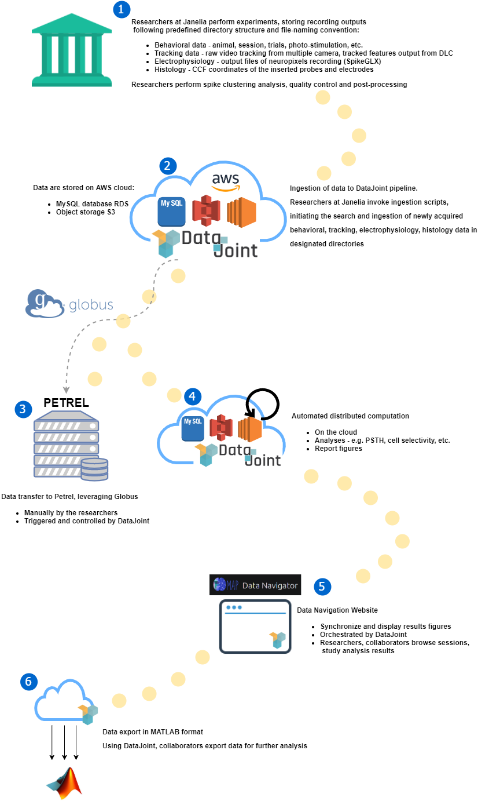

# Mesoscale Activity Project Pipeline

Mesoscale Activity Project Pipeline - [map-ephys](https://github.com/mesoscale-activity-map/map-ephys/)

## Overview

The MAP data pipeline is built using [DataJoint](http://datajoint.io), an
open-source framework for building scientific data pipelines. Users and data
scientists collaborate to define the structure of the pipeline with multiple
stages of data entry, acquisition, processing, and analysis.  They query data
using DataJoint\'s query language.  Experimental data streams are connected
upstream; analyses are made available to downstream applications as soon as new
data are available. DataJoint provides built-in support for parallel and
distributed batch computations. The pipeline is hosted in the [Amazon
Cloud](https://aws.amazon.com) and administered by [Vathes
LLC](https://www.vathes.com/).

The first part of the pipeline deals with entering manual data, and ingesting
and preprocessing the raw acquired data.  Static information like subject
details or experiment parameters are entered manually using
[Helium](https://mattbdean.github.io/Helium/) , a DataJoint-aware web data entry
interface.  These basic data serve as the start of the data pipeline.  From
here, behavioral data are detected as they are written to network shares by the
experimental computers and ingested into the DataJoint pipeline.  Manual spike
sorting is performed offline and separately and then detected and loaded into
the pipeline.  Bulky raw data (behavioral videos; raw ephys files) are
transferred via a separate segment of the pipeline over
[Globus/GridFTP](https://www.globus.org/) to archival storage hosted at ANL and
then removed from the source systems to free storage up space.  The archival
data transfer is managed by DataJoint as part of the pipeline itself; as a
consequence, the raw data can be easily retrieved or more widely published to
other remote users as DataJoint queries.  Additional data navigation and
retrieval interfaces are planned to facilitate more casual internal and public
access to the raw project data and provide support for publication-ready
identifiers such as [DOI](https://www.doi.org/).
 
The second part of the pipeline executes user-maintained analysis of the
acquired data.  The pipeline maintains dependencies between the data at each
stage of acquisition and processing.  As soon as any step of analysis completes
a portion of the data, it becomes available for the next step in analysis in a
distributed fashion.  Thus complex analyses are performed in discrete,
reproducible stages using Matlab or Python query interfaces. In collaborative
scenarios, private \'test\' pipeline segments are first developed and debugged and
then grafted into the main pipeline codebase via code merge/review and then made
available for more permanent or official public use within the team.
 
Cloud hosting of the project pipeline enables sharing of analysis results in
real-time to other collaborators within the project community and, in future
stages of the project, will also allow more public access to the data, both
using DataJoint and also via more casual interfaces under development. Cloud
hosting also allows centralizing the project data into a single data repository
which facilitates easier long-term data stewardship and maintenance.
 

 
When possible, DataJoint schemas are consistent and compatible with the
[Neurodata Without Borders (NWB)](https://www.nwb.org/) data format, a data
standard for neurophysiology data. The MAP project is currently working with
Vathes to develop interfaces between DataJoint and NWB.

## Pipeline Architecture

This section describes the architecture of this pipeline, including schema and table design, their dependencies.

This is particularly important for downstream users to query and perform further analysis on the data and analysis results. 

[Redirect to Pipeline Architecture](./pipeline_architecture.md)

## Data Flow

This section presents detailed description of the dataflow and workflow implemented in this pipeline,
this includes:
    + Flow of data ingestion for behavior, tracking, ephys, histology data
    + Sequence of preprocessing and analysis performed by the pipeline
    + Figure generation mechanism
    
[Redirect to Data Flow](./data_flow.md)

## Ingestion Setup and Instruction

This section describes in detail the programming environment setup and configuration to ingest data into this pipeline. 
This is specifically relevant to the researchers that will contribute data to this project, particularly the researchers at Janelia Research Campus.

[Redirect to Ingestion Instruction](./ingestion_instruction.md)

## Petrel Archiving

All data are archived on Petrel, using Globus to facilitate high-speed transfer, all managed by DataJoint as part of this pipeline.

[Redirect to Petrel Archiving](./petrel_archiving.md)

## Analysis/Plotting/Data-export library

This pipeline features a library of specialized functions for:
+ analysis
+ visualization
+ data export

[Redirect to Analysis Library](./analysis_library.md)

## System management

This section is dedicated for the running and management of this pipeline, including details for:
+ Setup and launching of workers for automated tasks
+ Setup and launching of the MAP [Web-GUI](http://map-navigator.datajoint.io/)
+ Database administration
+ AWS resource management

[Redirect to System Management](./system_management.md)

## Developer Guide

This section contains notes related to pipeline development and testing,
such as development specific configuration and tests.

[Redirect to Developer Guide](./developer_setup.md)

