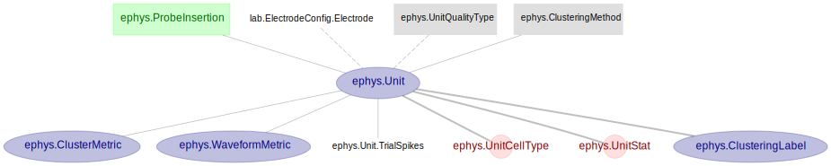
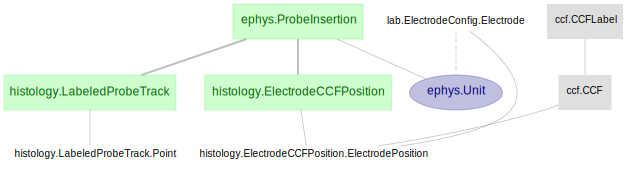

# MAP Pipeline Architecture

This document describes the schemas, tables and their dependencies that make up of the MAP electrophysiology pipeline.

Note that, in DataJoint, a schema is a namespace for grouping of related tables, and tables from all schema can and often do reference one another.

The MAP pipeline consists of 6 core schemas:
+ ***lab*** - tables related to the lab management activity - e.g. animal, rig, probe, etc.
+ ***experiment*** - tables describing the experiment - e.g. sessions, trials, photostim, etc.
+ ***tracking*** - tables for tracking data - e.g. jaw, paw, tounge, whisker movements
+ ***ephys*** - tables related to extracellular ephys recording and spike sorting - e.g. probe insertion, clustering, units, spike-times, etc.
+ ***histology*** - tables for the histology data - e.g. probe tracks, electrode CCF location, etc.
+ ***psth*** - tables for analysis on the sorted spikes - e.g. PSTH, unit selectivity, etc.

Other non-core schemas:
+ ingestion-related schemas
+ ccf - tables with look-up values for CCF
+ report - tables for generated result figures
+ publication - tables to facilitate tracking and transfering of data to/from Petrel, using Globus

The following sections dive into the detail design of each of the core schemas and their dependencies. 
We want to emphasize again the fact that tables from all schemas are inter-dependent on each other, 
separation into multiple schemas is merely for logical grouping and ogranizational purpose, in a sense, all schemas merge together to form this MAP pipeline.

## lab *schema*

### The "Animal" part

### The "Probe" part

In the above ***Probe*** design, `lab.ProbeType` represents a type of probe: Tetrode, Neuropixels 1.0, 2.0, multi-shank, single-shank,
Accompanying `lab.ProbeType` is a part-table `lab.ProbeType.Electrode`, 
describing full electrode geometry (e.g. site location)
 and organization (e.g. shank, shank column/row) for all the electrode sites of this probe (e.g. 960 sites for Neuropixels 1.0)
 
Whereas `lab.Probe` represents one physical probe, identified by a unique number (e.g. serial number).

`lab.ElectrodeConfig` specifies one Electrode Configuration used for the recording, 
particularly which subset of the electrode sites used for recording (e.g. which 384 electrodes from Neuropixels 1.0 probe)

## experiment *schema*

### The session/trial part

The hierarchical organization of session and trial, depicted above, is as followed:
+ `experiment.Session` stores the session(s) per subject
+ `experiment.SessionTrial` represents the many trials per session
+ `experiment.BehaviorTrial` and `experiment.PhotostimTrial` provides further categorization and description per trial
    + Under `experiment.BehaviorTrial` are the labelings for that behavior trial
        + `experiment.TaskProtocol`: which experimental paradigm used
        + `experiment.EarlyLick`: 'early' | 'no early'
        + `experiment.TrialInstruction`: 'left' | 'right'
        + `experiment.Outcome`: 'hit' | 'miss' | 'ignore'
    + `experiment.PhotostimTrial` indicates the trial to have optogenetic stimulation,
     with details of each stimulation event (e.g. timing, power, etc.) specified in `experiment.PhotostimEvent`
    + `experiment.TrialEvent` records the details and timing of per-trial experiment event
     (e.g. onsets of 'sample', 'delay', 'response' period)
    + `experiment.ActionEvent` records the actions the animal took during the trial
     (e.g. lick left, lick right, etc.)
     

## tracking *schema*

The `tracking.Tracking` stores the tracking data on a per-trial basis, referencing the `experiment.BehaviorTrial` 
as the parent table. Each of the part-table contains time-series data of the tracked (using DeepLabCut) feature
 (e.g. paw, toungue, jaw, whisker, etc.) from the behavior video recording.
 

## ephys *schema*

### The probe insertion part

The `ephys.ProbeInsertion` represents both the surgical insertion of the probe into the animal for a particular session, 
as well as the extracellular electrophysiology recording performed on that probe for that session.

Beside session (`experiment.Session`), the "parents" of `ephys.ProbeInsertion` also includes `lab.Probe`
 and `lab.ElectrodeConfig`. These two tables provide full description about the probe type and probe, as well as the
 electrode configuration used for this recording. 
 
The `ephys.ProbeInsertion.InsertionLocation` records the surgical details of the intended insertion location,
 with precise targeted coordinate information: AP, ML, depth, theta, phi, beta and skull reference (e.g. lambda, bregma)
 
The `ephys.ProbeInsertion.RecordableBrainRegion` records the one or multiple brain regions
 (e.g. left ALM, right Medulla, etc.) that this probe insertion may potentially record from.
  This information is specified by the experimenter, thus carries his/her subjective assessment. 
  The exact insertion location is determined using histology data, stored in the `histology` schema.

### The spike-sorting part

The set of units for each `ephys.ProbeInsertion` represents the results of a spike-sorting analysis routine,
 with the specific method (e.g. Kilosort, JRClust, etc.) specified in the `ephys.ClusteringMethod`.
 
Each unit in the `ephys.Unit` includes:
+ Quality type: 'good' | 'noise' | 'mua'
+ Meta information of the clustering in `ephys.ClusteringLabel`: 
    + timestamp of the clustering
    + is manual curation perform
    + is quality control performed
+ Reference to the ***electrode site*** this unit is associated with - `lab.ElectrodeConfig.Electrode`
+ Statistics:
    + Amplitude, SNR - in `ephys.Unit`
    + Firing Rate, ISI-violation - computed and stored in `ephys.Stat`
    + Cell-type - computed based on waveform shape and stored in `ephys.UnitCellType` 
    + Quality Control metrics: `ephys.ClusterMetric` and `ephys.WaveformMetric`
+ ***Spike times*** - unit's spike times for the entire recording duration
+ ***Mean waveform*** - average waveform over spikes extracted at the peak channel 
+ ***Trial's spike times*** - `ephys.Unit.TrialSpikes` - unit's spike times ***per trial***, time-locked to the `go-cue` onset

## histology *schema*

The histology data in the MAP pipeline consists of 2 types:
+ Electrode CCF location, in `histology.ElectrodeCCFPosition.ElectrodePosition`
 - provides the x, y, z of the electrode site in CCF coordinate
+ Probe tracks, the manually annotated points of the probe tracks, stored in `histology.LabeledProbeTrack`

A unit's CCF location can be indirectly determined by cross checking the electrode site associated with that unit
 and the CCF location of the electrode site.

## psth *schema*

For each `ephys.Unit`, unit PSTHs are computed from the trial spike times (`ephys.Unit.TrialSpikes`),
 for different trial conditions. Hence, a `psth.TrialCondition` table is defined to store different condition criteria:

Some example trial-condition includes:
+ "good_noearlylick_hit": no early-lick with correct response trials
+ "good_noearlylick_left_hit": no early-lick with correct response left-lick instructed trials
+ "good_noearlylick_right_miss": no early-lick with incorrect response right-lick instructed trials
+ "all_noearlylick_nostim": no early-lick with no photostim trials
+ "all_noearlylick_left_alm_stim": no early-lick with left-ALM photostim trials

The `psth.PeriodSelectivity` table perform the selectivity computation and store the results
 for each unit at each period as defined in the `experiment.Period` table. There are 3 periods defined:
+ Sample
+ Delay
+ Response

The `psth.UnitSelectivity` table aggregates the 3 period-selectivity for each unit, computed in `psth.PeriodSelectivity`,
 and computes the overall selectivity for that unit. 

